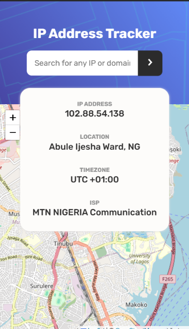
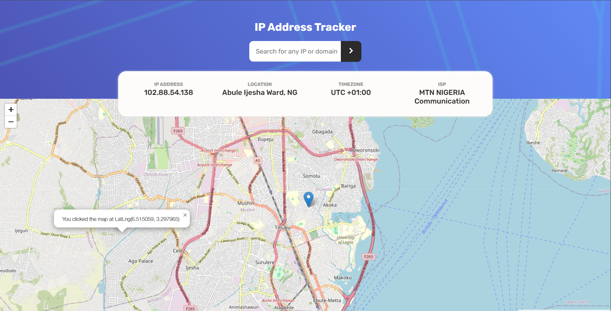

# IP Address Tracker Web Application

This project is a real-world IP address tracking web application that allows users to search for any IP address or domain and view detailed geolocation information in an interactive map interface.

It consumes a third-party IP geolocation API, visualizes location data using LeafletJS, and securely proxies API requests through Vercel serverless functions to protect sensitive API keys in production.


## Overview
The application automatically detects the user’s IP address on initial load and displays key information such as location, ISP, timezone, and coordinates on a map. Users can also search for any valid IP address or domain and instantly see updated results.

This project demonstrates practical frontend development skills beyond layout, including API consumption, map integration, error handling, and secure deployment practices.

### Features

* Detects and displays the user’s current IP address on page load

* Searches any IP address or domain in real time

* Displays geolocation data including ISP and timezone

* Interactive map visualization with dynamic marker updates

* Fully responsive layout across mobile and desktop devices

* Secure API handling using serverless functions

### Screenshot





### Live Demo and Source

- Solution URL: [FrontEndMentor](https://www.frontendmentor.io/solutions/ip-address-tracker-lOdn_K94lm)
- Live Site URL: [Vercel](https://ip-tracker-jet.vercel.app/)


### Tech Stacks

* HTML5 (Semantic Markup)
* CSS (Flexbox and Grid, mobile first workflow).
* JavaScript
* LeafletJS interactive maps
* IP Geolocation API by IPify
* Vercel Serverless Functions for API key protection


### Implementation Notes

To prevent exposing the API key on the client, all geolocation requests are routed through a serverless function deployed on Vercel. This backend proxy handles API communication securely and avoids common CORS and key-leak issues.

The map updates dynamically by repositioning the marker and viewport whenever a new IP address or domain is searched.


```js
map.setView([lat, lng], 13);
map.removeLayer(marker);
marker = L.marker([lat, lng]).addTo(map);
```


### What I Learned

* Consuming and handling third-party APIs in real applications

* Integrating and controlling interactive maps with LeafletJS

* Using serverless functions to secure sensitive data

* Debugging real-world issues such as CORS errors and 403 responses

* Managing asynchronous data flow and UI updates

### Future Improvements

* Improved error handling and user feedback states

* Loading indicators and subtle UI animations

* Rate limiting and deeper backend security exploration

* Expansion into more full-stack, serverless-based projects


## Author

**Awosanya Ifeoluwa (Vipzy)**
* GitHub: [https://github.com/viipzy](https://github.com/viipzy)
* Frontend Mentor: [https://www.frontendmentor.io/profile/viipzy](https://www.frontendmentor.io/profile/viipzy)

